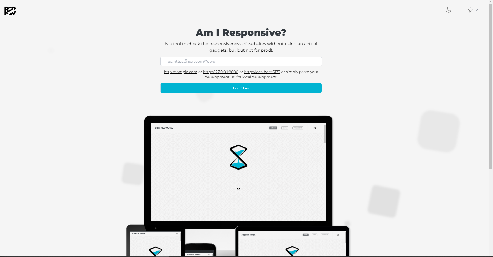

## Amiresponsive
is a tool to check the responsiveness of websites without using an actual gadgets. bu.. but not for prod!.



## What(s) new? ✨

> Unlike version 1, in version 2 I still used Vue.js3 but with TypeScript, Vite, and TailwindCSS in replacement of Vuetify3. <br> The application size (gzipped) was reduced from <code style="font-size: 30px; color: orange;">***154.82kb***</code> to <code style="font-size: 30px; color: yellow;">***56.63kb***</code> minified as twice!.

- [x] Vuejs3 =>  <b style="text-decoration: underline;">Vuejs3 TypeScript</b>
- [x] Vite
- [x] Vuetify3 =>  <b style="text-decoration: underline;">TailwindCSS</b>
- [x] Can now output both global (https) and local (http) systems
- [x] New user interface
- [x] Minified and made faster using TailwindCSS :zap:
- [x] Remade using vuejs with typescript
- [ ] Output can be downloaded as png :shipit:

<div>
    
    
    
    
</div>

## Future Features ⏳

- [ ] Users can create an account
- [ ] Users created an account can save their outputs via limited inventory

## Why?
Most websites are now being used on different devices.
> As a front-end developer, hypothetically, responsiveness takes up about 90% of the whole project for most websites if implemented for multiple devices. Imagine creating a full-stack app where all the functions are set up, the backend and database are finished, and the trial is on Monday. Now, imagine reading this and realizing that your website isn't yet responsive.

## Run it!

- <a href="https://amiresponsive.netlify.app/">https://amiresponsive.netlify.app/</a>

<!-- ## Run it! -->

<!-- ### to run local development apps like `http://localhost:5173/ or http://192.168.1.5:5173/ or http://127.0.0.0/`
```
git clone ${}0
yarn or npm install
yarn dev
``` -->

